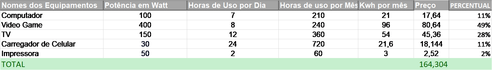

# EXCEL BÁSICO - PROJETO INTEGRADOR II

# PLANILHA EXCEL
1. Panilha auxiliar de estudos em Física\
[Planilha excel referênte a atividade](Projeto_Integrador_2_Murillo.xlsx)

# IMAGENS
2. Imagens Referêntes a Planilha\
\

# SLIDE
3. Slide Referênte a Planilha\
[Slide referênte a atividade](PPTX-EXCEL.pptx)

# DOCUMENTO WORD
4. Documento word referênte a Planilha\
[Documento word referênte a atividade](Doc-Word.docx)
