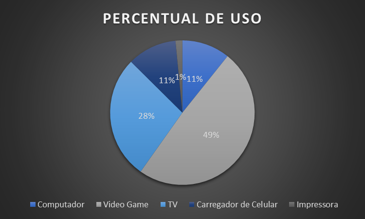

# EXCEL BÁSICO - PROJETO INTEGRADOR II

# PLANILHA EXCEL
1. PLANILHA AUXILIAR DOS ESTUDOS EM FÍSICA\
[Planilha excel referênte a atividade](Projeto_Integrador_2_Murillo.xlsx)

# IMAGENS
2. GRÁFICO DE PIZZA\

3. TABELA EXCEL\

# SLIDE
4. SLIDE COM APLICAÇÃO DAS IMAGENS\
[Slide referênte a atividade](PPTX-EXCEL.pptx)

# DOCUMENTO WORD
5. DOCUMENTO WORD COM APLICAÇÃO DAS IMAGENS\
[Documento word referênte a atividade](Doc-Word.docx)
